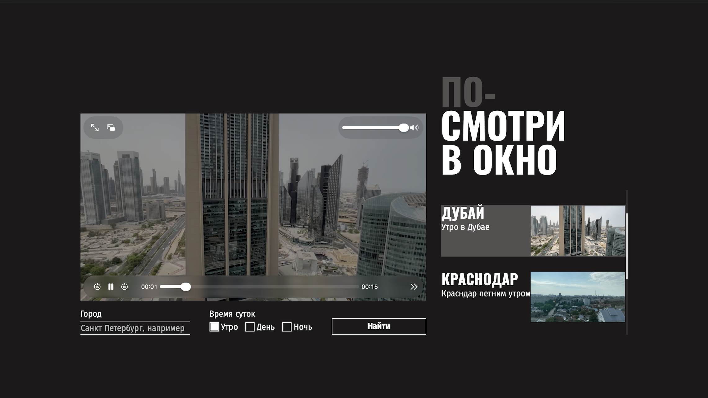

https://github.com/Ibrashka07/posmotri-v-okno-ad

# Проектная работа от Яндекс Практикума "Посмотри в окно"

## Оглавление 
- [Скриншот](#скриншот)
- [Макет сайта](#макет-сайта)
- [Описание](#описание)
- [Автор](#автор)
- [Благодарность](#благодарность)

## Скриншот

## Макет сайта
[Figma](https://www.figma.com/design/vCfXwrcREKdx7cs4aJuHPg/FD%3A-2-спринт.-Проектная-работа?node-id=0-1&p=f)

## Описание
Данное приложение позволяет "выглянуть" из окон самых разных городов мира!

## Автор
GitHub - [Ибрагим Карданов](https://github.com/Ibrashka07)

# Благодарность
Спасибо команде Яндекс Практикума за предоставленные уроки и дизайн!!